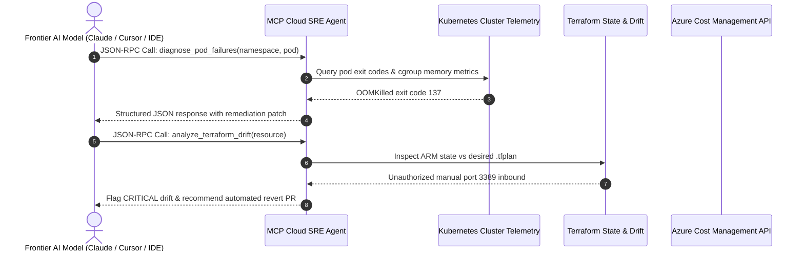

# 📐 MCP Cloud SRE Agent Architecture

```mermaid
sequenceDiagram
    autonumber
    actor LLM as Frontier AI Model (Claude / Cursor / IDE)
    participant MCP as MCP Cloud SRE Agent
    participant K8s as Kubernetes Cluster Telemetry
    participant TF as Terraform State & Drift
    participant FinOps as Azure Cost Management API

    LLM->>MCP: JSON-RPC Call: diagnose_pod_failures(namespace, pod)
    MCP->>K8s: Query pod exit codes & cgroup memory metrics
    K8s-->>MCP: OOMKilled exit code 137
    MCP-->>LLM: Structured JSON response with remediation patch
    
    LLM->>MCP: JSON-RPC Call: analyze_terraform_drift(resource)
    MCP->>TF: Inspect ARM state vs desired .tfplan
    TF-->>MCP: Unauthorized manual port 3389 inbound
    MCP-->>LLM: Flag CRITICAL drift & recommend automated revert PR
```